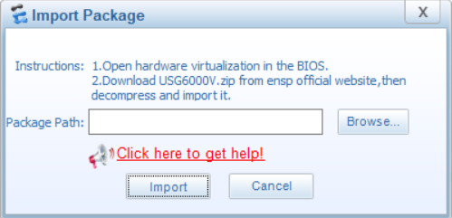

# Instalasi eNSP

Sebelum melakukan proses install, ada beberapa file yang diperlukan antara lain,
* eNSP installation package
* USG6000V package
* Hedex installation package
* VirtualBox 5.2.28
* Wireshark
* WinPcap

## Install VirtualBox 5.2.28
Proses intallasi VirtualBox sama dengan aplikasi pada umumnya.

## Install WinPcap
Proses install winpcap sama dengan aplikasi pada umumnya.

## Install Wireshark
Proses install wireshark hampir sama dengan aplikasi pada umumnya.

Karena kita akan menggunakan WinPcap, maka kita uncheck / tidak perlu menginstall Npcap.

Untuk USB Capture bersifat optional, dapat diinstall ataupun tidak. Tapi disini saya akan tetap menginstallnya.

Setelah proses selesai dapat memilih proses reboot later.

## Install eNSP
Sebelum memulai instal eNSP, perlu memperhatikan jumlah RAM dan free disk yang tersedia. Dianjurkan kapasitas RAM 4 GB atau lebih tinggi dan free disk 10 GB atau lebih tinggi.

Untuk tahap ini tinggal klik Next saja.

Ada proses yang melakukan pengecekan apakah tools yang diperlukan menjalankan eNSP sudah terinstall semua, tampilannya akan seperti ini.

Jika ada permintaan dari Windows Defender Firewall seperti gambar berikut, check untuk private network dan public network.

Jika tidak menambahkan public network, akan muncul warning seperti berikut

## Import USG6000V Package
Untuk import USG6000V, kita buka dulu eNSP dan membuat topology baru.

drag and drop firewall dengan nama USG6000V seperti gambar berikut.

Setelah itu klik kanan dan klik start.

Nanti akan muncul pop-up untuk mengimport file USG6000V, dan klik import.

Jika masih ada error 40, 45 ataupun hanya menampilkan ####, kemungkinan ada permasalahan dengan virtualisasinya. 

Untuk itu mengecek pada VirtualBox dan melihat apakah tab Processor dan Acceleration bisa dibuka.

## Reference

* [Solutions for eNSP device startup failure](https://forum.huawei.com/enterprise/en/solutions-for-ensp-device-startup-failure/thread/595014-865)
* [Raw-mode is unavailable courtesy of Hyper-V](https://stackoverflow.com/questions/50053255/virtualbox-raw-mode-is-unavailable-courtesy-of-hyper-v-windows-10)